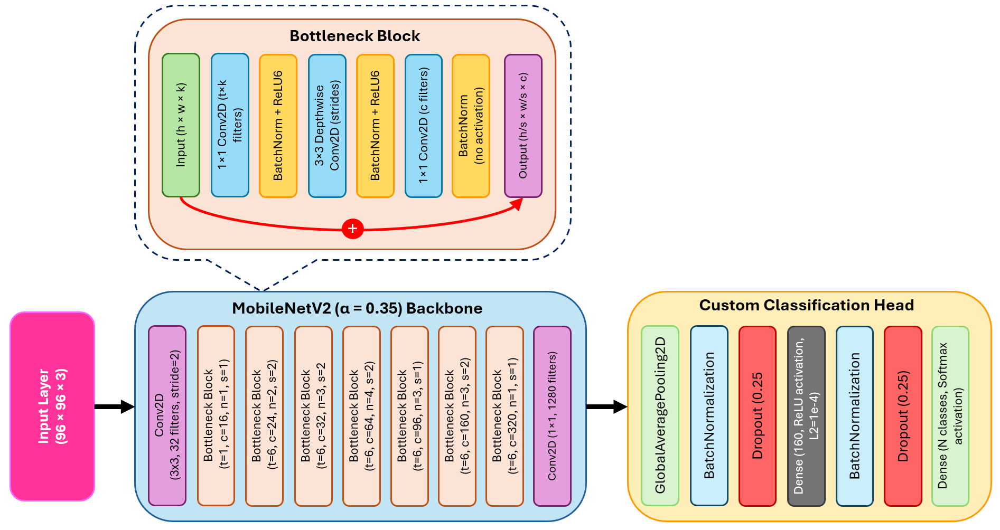
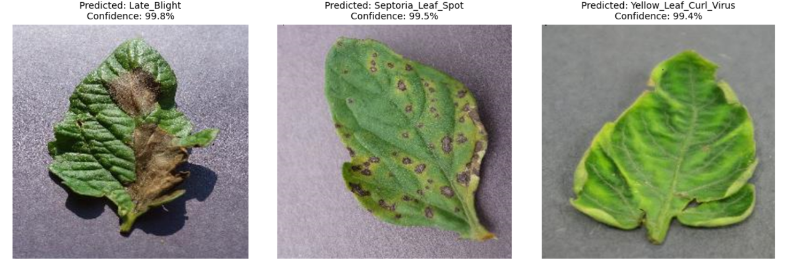

# TinyLeafNet-IoT - Automated Tomato Leaf Disease Detection and Alert System using Internet of Things and TinyML
TinyLeafNet-IoT is a lightweight TinyML-based IoT system for real-time tomato leaf disease detection on microcontrollers. TinyML model, trained on the <a href="https://github.com/spMohanty/PlantVillage-Dataset">PlantVillage dataset</a>, achieves 97.2% accuracy and streams results via MQTT to a cloud dashboard. The solution offers low-power, cost-effective disease monitoring for precision agriculture.
<br/><br/>
## System Pipeline


## Model Architecture



## Code

The following custom code is used in <a href="https://edgeimpulse.com/">Edge Impulse</a> to build model.
```
import math, requests
from pathlib import Path
import tensorflow as tf
from tensorflow.keras import Model
from tensorflow.keras.models import Sequential
from tensorflow.keras.layers import (
    Dense, InputLayer, Dropout, Conv1D, Flatten, Reshape, MaxPooling1D, BatchNormalization,
    Conv2D, GlobalMaxPooling2D, Lambda, GlobalAveragePooling2D)
from tensorflow.keras.optimizers.legacy import Adam, Adadelta
from tensorflow.keras.losses import categorical_crossentropy

from tensorflow.keras.regularizers import l2

sys.path.append('./resources/libraries')
import ei_tensorflow.training

WEIGHTS_PATH = './transfer-learning-weights/keras/mobilenet_v2_weights_tf_dim_ordering_tf_kernels_0.35_96.h5'

# Download the model weights
root_url = 'https://cdn.edgeimpulse.com/'
p = Path(WEIGHTS_PATH)
if not p.exists():
    print(f"Pretrained weights {WEIGHTS_PATH} unavailable; downloading...")
    if not p.parent.exists():
        p.parent.mkdir(parents=True)
    weights_data = requests.get(root_url + WEIGHTS_PATH[2:]).content
    with open(WEIGHTS_PATH, 'wb') as f:
        f.write(weights_data)
    print(f"Pretrained weights {WEIGHTS_PATH} unavailable; downloading OK")
    print("")

INPUT_SHAPE = (96, 96, 3)


base_model = tf.keras.applications.MobileNetV2(
    input_shape = INPUT_SHAPE, alpha=0.35,
    weights = WEIGHTS_PATH
)

base_model.trainable = False

model = Sequential()
model.add(InputLayer(input_shape=INPUT_SHAPE, name='x_input'))

# Intermediate feature extractor
last_layer_index = -3
feature_extractor = Model(
    inputs=base_model.inputs,
    outputs=base_model.layers[last_layer_index].output
)
model.add(feature_extractor)

# Pooling
model.add(GlobalAveragePooling2D())

# Normalization + Regularization
model.add(BatchNormalization())
model.add(Dropout(0.25))

# Slightly wider Dense layer with L2 regularization
model.add(Dense(160, activation='relu', kernel_regularizer=l2(1e-4)))
model.add(BatchNormalization())
model.add(Dropout(0.25))

# Output
model.add(Dense(classes, activation='softmax'))

BATCH_SIZE = args.batch_size or 32
EPOCHS = args.epochs or 50
LEARNING_RATE = args.learning_rate or 0.0005
# If True, non-deterministic functions (e.g. shuffling batches) are not used.
# This is False by default.
ENSURE_DETERMINISM = args.ensure_determinism
if not ENSURE_DETERMINISM:
    train_dataset = train_dataset.shuffle(buffer_size=BATCH_SIZE*4)
prefetch_policy = 1 if ENSURE_DETERMINISM else tf.data.AUTOTUNE
train_dataset = train_dataset.batch(BATCH_SIZE, drop_remainder=False).prefetch(prefetch_policy)
validation_dataset = validation_dataset.batch(BATCH_SIZE, drop_remainder=False).prefetch(prefetch_policy)
callbacks.append(BatchLoggerCallback(BATCH_SIZE, train_sample_count, epochs=EPOCHS, ensure_determinism=ENSURE_DETERMINISM))


model.compile(optimizer=tf.keras.optimizers.Adam(learning_rate=LEARNING_RATE),
                loss='categorical_crossentropy',
                metrics=['accuracy'])
model.fit(train_dataset, validation_data=validation_dataset, epochs=EPOCHS, verbose=2, callbacks=callbacks)

print('')
print('Initial training done.', flush=True)

# How many epochs we will fine tune the model
FINE_TUNE_EPOCHS = 30
# What percentage of the base model's layers we will fine tune
FINE_TUNE_PERCENTAGE = 65

print('Fine-tuning best model for {} epochs...'.format(FINE_TUNE_EPOCHS), flush=True)

# Load best model from initial training
model = ei_tensorflow.training.load_best_model(BEST_MODEL_PATH)

# Determine which layer to begin fine tuning at
model_layer_count = len(model.layers)
fine_tune_from = math.ceil(model_layer_count * ((100 - FINE_TUNE_PERCENTAGE) / 100))

# Allow the entire base model to be trained
model.trainable = True
# Freeze all the layers before the 'fine_tune_from' layer
for layer in model.layers[:fine_tune_from]:
    layer.trainable = False

model.compile(optimizer=tf.keras.optimizers.Adam(learning_rate=0.000045),
                loss='categorical_crossentropy',
                metrics=['accuracy'])

model.fit(train_dataset,
                epochs=FINE_TUNE_EPOCHS,
                verbose=2,
                validation_data=validation_dataset,
                callbacks=callbacks,
                class_weight=None
            )

```

## Results


## How to use this model?
To test **TinyLeafNet-IoT** model, download the TensorFlow Lite <a href="https://github.com/tim3in/TinyLeafNet-IoT/blob/main/model/tinyleafnetiot.lite">Model</a> and run the code in <code>TinyLeafNet_IoT.ipynb</code>. <br/><br/>
*Note:* The model is trained to detect five classes:<br/>
- Late Blight
- Leaf Mold
- Septoria Leaf Spot
- Spider Mites
- Yellow Leaf Curl Virus
