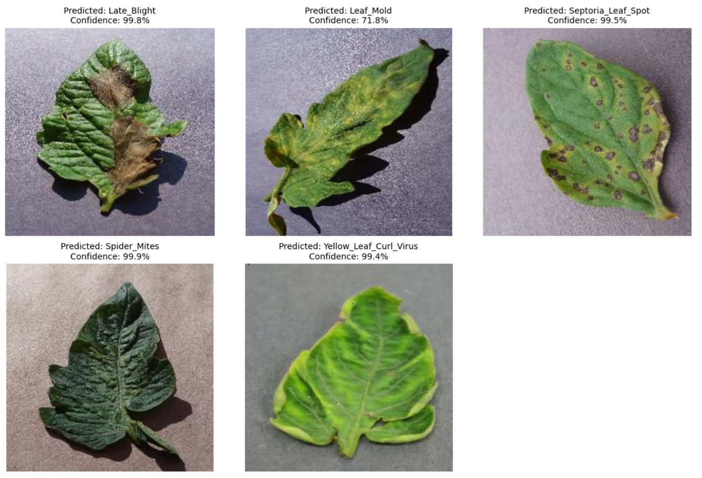

# TinyLeafNet-IoT - Automated Tomato Leaf Disease Detection and Alert System using Internet of Things and TinyML
TinyLeafNet-IoT is a lightweight TinyML-based IoT system for real-time tomato leaf disease detection on microcontrollers. TinyML model, trained on the <a href="https://github.com/spMohanty/PlantVillage-Dataset">PlantVillage dataset</a>, achieves 97.2% accuracy and streams results via MQTT to a cloud dashboard. The solution offers low-power, cost-effective disease monitoring for precision agriculture.
  
## System Pipeline

## Model Architecture

## Results

## How to use this model?

Download the <a href="https://github.com/tim3in/TinyLeafNet-IoT/blob/main/model/tinyleafnetiot.lite">model</a> and run the code in <code>TinyLeafNet_IoT.ipynb</code>.
